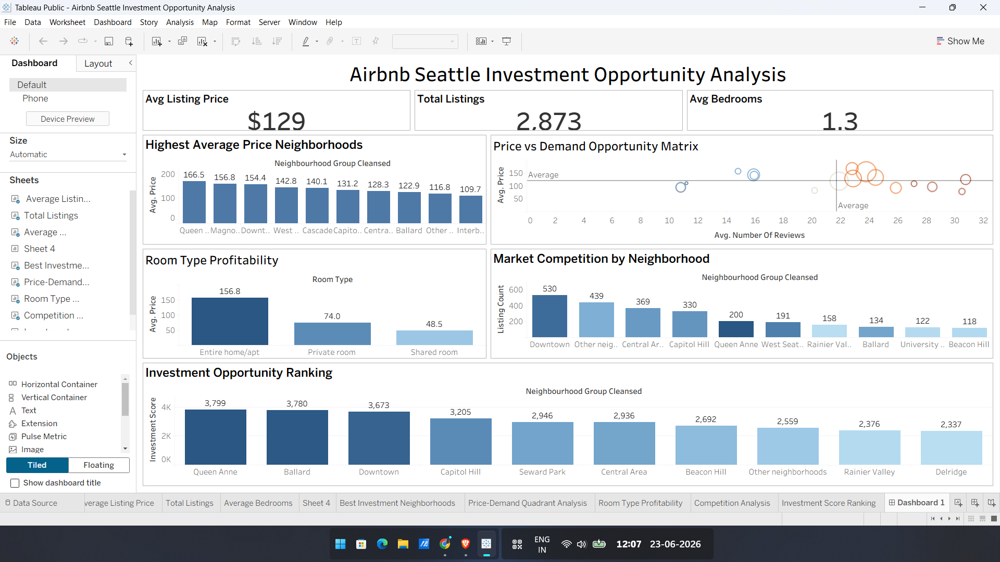

Airbnb Seattle Investment Opportunity Analysis
Overview

This project analyzes Seattle Airbnb listings using Tableau to identify profitable investment opportunities across neighborhoods.

The dashboard evaluates:

Average listing prices
Demand based on review activity
Neighborhood competition
Room type profitability
Investment opportunity rankings
Dashboard Preview

Interactive Dashboard

Tableau Public Dashboard:
https://public.tableau.com/views/AirbnbSeattleInvestmentOpportunityAnalysis/Dashboard1?:language=en-US&:sid=&:redirect=auth&publish=yes&showOnboarding=true&:display_count=n&:origin=viz_share_link

Key Business Insights
Highest Average Price Neighborhoods
Queen Anne
Magnolia
Downtown
Most Profitable Room Type
Entire Home / Apartment
High Demand Areas
Queen Anne
Capitol Hill
Downtown
Investment Opportunity Ranking

Top investment neighborhoods identified using a custom scoring model:

Queen Anne
Ballard
Downtown
Capitol Hill
Tools Used
Tableau Public
Microsoft Excel
Data Cleaning
Data Visualization
Business Analytics
Skills Demonstrated
Dashboard Development
KPI Design
Calculated Fields
Interactive Filters
Data Storytelling
Business Intelligence
